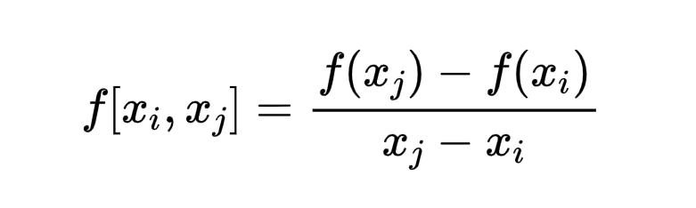

# 正交多项式

## 定义

### 正交

记区间 \[ a, b ] 上所有<mark style="color:red;">连续函数</mark>的全体为 C\[ a, b ] ，可以证明 C\[ a, b ] 是一个线性空间，将所有<mark style="color:red;">次数不超过 n</mark> 的<mark style="color:red;">多项式全体</mark>记为 <mark style="color:red;">Pn</mark> ，则 Pn 是 C\[ a, b ] 的子空间。

<figure><figcaption></figcaption></figure>

若 ( f, g ) = 0 ，则称 f ( x ) 与 g ( x ) 正交，记为.

### 权函数

考虑到 f(x) 在区间 \[a, b] 上各点函数值比重不同, 常引进加权形式的内积:

<figure><figcaption></figcaption></figure>

其中权函数 (x) 为非负连续函数.

### 定理

若为 C\[ a, b ] 上的一组线性无关函数，则可得到 C\[ a, b ] 上一组两两正交的函数组 满足

（1）为的线性组合

（2）为的线性组合

### 构造过程

按照<mark style="color:blue;">Schemite正交化</mark>过程构造函数即可

<figure><figcaption></figcaption></figure>

两两正交且满足 (1)、(2), 再令

<figure><figcaption></figcaption></figure>

称函数组为<mark style="color:red;">规范正交组</mark>。

Pn 上由<mark style="color:blue;">线性无关</mark>函数经过Schemite正交化过程所得多项式称为 \[a, b] 上的<mark style="color:red;">正交多项式</mark>.

## 代码实现

由于python库对于普通的正交多项式支持较差，而对于其他几种特殊的正交多项式支持较好，所以我们着重研究其他几种正交多项式的结果。
