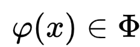

# 最小二乘法

## 定义

数据拟合问题：在给定函数类上，根据给出的某组离散数据作出逼近曲线，要求逼近曲线在xi处与离散数据尽可能接近。对于函数 ，要求以在离散点的误差  为分量的误差向量按某一向量范数达到最小.对不同的范数, 构造出不同意义下的拟合函数.

其中，函数系在包含节点的区间 \[a, b] 上线性无关。

常用的函数系有幂函数系，三角函数系，指数函数系，正交函数系。

最常用的是幂函数系，即此时所求拟合曲线称为多项式拟合曲线。

为了便于计算，在求误差向量时，宜采用向量2-范数，此即为最小二乘法。

此方法巧妙地将寻找拟合曲线的问题转化为求多元函数的最小值问题：

<figure><figcaption></figcaption></figure>

在解决实际问题时, 我们还需考虑到数据的比重不同, 故常常采用误差向量的加权范数形式，故上式右侧为\


<figure><figcaption></figcaption></figure>

其中( x ) > 0 其在 \[ a, b ] 上的权函数。

计算机中实现则使用矩阵形式：

<figure><figcaption></figcaption></figure>

称为 (由最小二乘法导出的) 正则方程组或法方程组。

可由平方根法或 SOR 法求得唯一解  。

## 代码实现

通过调用已经封装好的库函数，我们得到如下实现过程：

```python
# 最小二乘法
import numpy as np
import matplotlib.pyplot as plt

# 生成模拟数据
np.random.seed(499)
x = np.linspace(0, 10, 50)
y = 2 * x + 3 + np.random.normal(0, 2, 50)

# 使用最小二乘法拟合数据
A = np.vstack([x, np.ones(len(x))]).T
k, b = np.linalg.lstsq(A, y, rcond=None)[0]
```

我们可以绘制图像，以更直观地观察数据：

```python
# 绘制原始数据和拟合直线
plt.figure(figsize=(8, 6))
plt.scatter(x, y, label='Original Data')
plt.plot(x, k*x + b, color='r', label=f'Fitted Line: y = {k:.2f}x + {b:.2f}')
plt.xlabel('X')
plt.ylabel('Y')
plt.title('Linear Regression using Least Squares Method')
plt.legend()
plt.grid()
plt.show()
```
