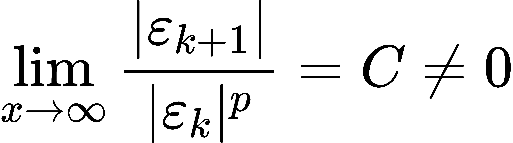

# 迭代法的收敛速度

记第 k 次迭代误差为 εk = α − xk，并假设迭代公式是收敛的，若存在实数 p ⩾ 1 使得

<figure><figcaption></figcaption></figure>

则称迭代公式是 p 阶收敛的，C 称为渐进误差常数。

* 当 p = 1 时，则称迭代公式为线性收敛；
* 当 p > 1 时，称迭代公式为超线性收敛；
* 当 p = 2 时，称迭代公式为平方收敛；

该部分通过手算可以得到验证，故不再赘述。
